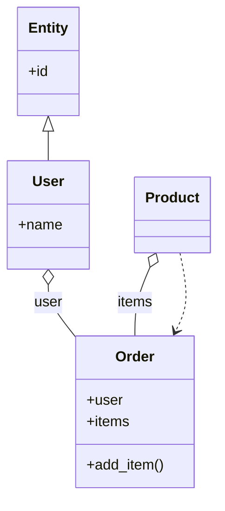

# 🌍 Marco
**A CLI Tool to Cartograph Codebases**

Marco is a high-performance CLI tool written in **Rust** that scans your codebase and generates **Mermaid.js Class Diagrams**. It helps developers visualize structure, inheritance, and relationships in large projects quickly.

## 🚀 Features
- **Fast Scanning**: Uses the `ignore` crate to traverse directories while respecting `.gitignore`.
- **Accurate Parsing**: Leverages `tree-sitter` for robust AST-based code analysis.
- **Advanced Relationships**: Detects not just inheritance, but also:
  - **Composition/Aggregation** (`*--`, `o--`) from properties and `__init__`.
  - **Dependencies** (`..>`) from method parameters and return types.
- **Visual Output**: Generates `.mmd` files ready for Mermaid.js rendering.
- **Multi-language Support**: 
  - [x] Python
  - [ ] Java (Coming soon)
  - [ ] C++ (Coming soon)

## 🛠️ Getting Started

### Prerequisites
- [Rust & Cargo](https://rustup.rs/) installed.

### Installation
You can build from source:

```bash
git clone https://github.com/wseabra/marco_polo.git
cd marco_polo
cargo install --path .
```

Now you can run the `marco` command from anywhere.

### Usage

```bash
marco [OPTIONS] [PATH]
```

**Arguments:**
- `[PATH]`: Path to the codebase to scan (defaults to current directory `.`).

**Options:**
- `-o, --output <FILE>`: Output file path for the Mermaid diagram (default: `output.mmd`).
- `-e, --extensions <EXT>`: Comma-separated list of file extensions to scan (default: `py`).
- `-h, --help`: Print help information.

**Example:**
```bash
marco ./src --output diagram.mmd
```

## 📊 Example Output

Given the following Python code:

```python
class Entity:
    def __init__(self, id: int):
        self.id = id

class User(Entity):
    def __init__(self, id: int, name: str):
        super().__init__(id)
        self.name = name

class Order:
    def __init__(self, user: User):
        self.user = user  # Aggregation
        self.items: List[Product] = []

    def add_item(self, product: Product): # Dependency
        self.items.append(product)
```

**Marco** generates the following Mermaid diagram:



## 🤝 Contributing
We love contributions! Whether it's adding support for a new language, fixing a bug, or improving documentation, here's how you can help:

1. **Fork** the repository.
2. **Create a branch** for your feature: `git checkout -b feat/my-new-feature`.
3. **Commit** your changes using [Conventional Commits](https://www.conventionalcommits.org/): `feat: add Java support`.
4. **Push** to your branch and **open a Pull Request**.

### Development
Run tests to ensure everything is working:
```bash
cargo test
```

## 📜 License
This project is licensed under the [MIT License](LICENSE).
